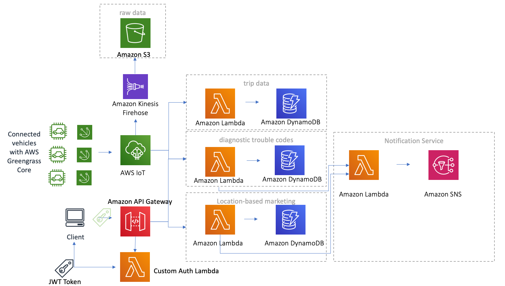
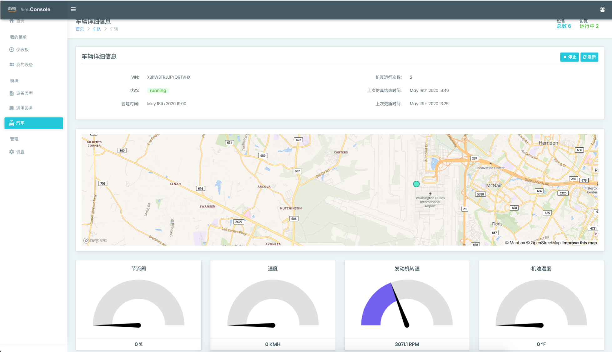
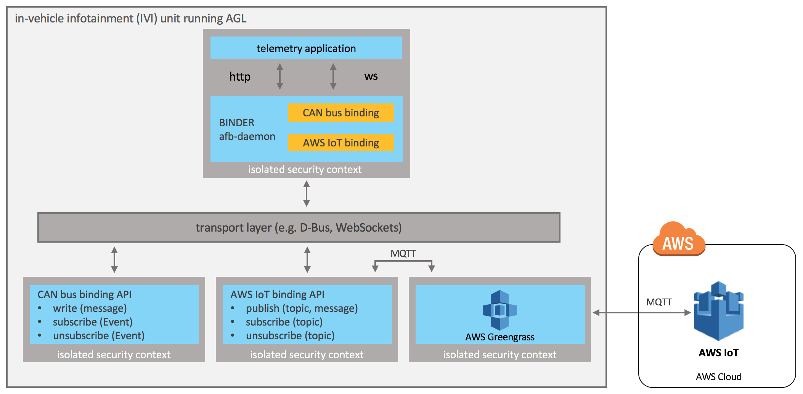

# 概览

利用Amazon Web Services (AWS)诸多服务，汽车制造商和供应商能够构建物联网应用程序。如按照无服务器架构开发应用程序，收集、处理、分析和处理连接的车辆所发送的数据，而无需管理任何基础设施。通过AWS物联网服务，您可以将车辆和设备安全以低延迟和低开销的方式连接到云。您也可以将物联网与其他AWS服务结合起来，构建事件驱动的应用程序。

此解决方案旨在为车联网解决方案开发提供一个框架，允许您将重点放在扩展此解决方案的功能上，而无需管理底层基础设施操作。您可以参考此框架来实现其他使用场景，如语音交互、导航和其他基于位置的服务、远程车辆诊断和健康监控、预测分析和维护警报、媒体流服务、车辆安全和移动应用程序等。


# 系统架构

## 架构描述

1. AWS IoT (https://aws.amazon.com/cn/iot/) 在收到消息时，会对消息进行身份验证和授权，而规则引擎会对消息执行相应的规则检查。随后将其路由到相应的后端应用程序。
2. AWS IoT 规则将车辆数据转发到 Amazon Kinesis Data Firehose (https://aws.amazon.com/cn/kinesis/data-firehose/) 流，原始数据保存到 Amazon S3 (https://aws.amazon.com/cn/s3/) 存储桶。
3. 负责行程数据的 AWS IoT 规则会实时处理检测并触发调用 AWS Lambda 函数来处理行驶中车辆发送的数据，并将其存储在 DynamoDB 表中。
4. 负责驾驶员安全评分的 AWS IoT 规则会行程结束后，进行触发调用 AWS Lambda 函数来处理聚合的行程数据。以便生成驾驶员安全评分、触发针对驾驶员的 Amazon SNS 通知，并将评分添加到行程数据 DynamoDB 表中。
5. 负责诊断故障代码的 AWS IoT 规则会检测 IoT 主题中的诊断故障代码，然后调用 Lambda 函数来将故障代码存储在 DynamoDB 表中。并将其转换为易懂的语言。
6. 负责基于位置的营销的 AWS IoT 规则会检测车辆的位置，然后调用 Lambda 函数来确定车辆是否位于兴趣点附近。当车辆靠近兴趣点时，该函数会将位置记录在 DynamoDB 表中，并触发针对用户的 Amazon SNS 通知，其中附带广告。
7. 如需使用 API Gateway 访问数据。首先需要提交用户名及密码，获得 JWT Token。然后在访问其他API Gateway接口时，都需在 Http 请求头 authotrization变量。API Gateway 对于每个 Http 请求，都会检测 authotrization的有效性。

## 功能模块
### IoT消息认证

当AWS IoT收到消息时，它对消息进行身份验证和授权，规则引擎对消息执行适当的规则，规则引擎将消息路由到适当的后端应用程序。AWS IoT的所有连接点都利用了双向身份验证和数据加密传输的优势，以确保在没有经过验证的身份的情况下，不会在车辆和AWS IoT之间交换数据。对于联网车辆，建议将MQTT连接与基于X.509证书的身份验证一起使用。

### 行程数据

车辆的行驶时数据不断的发送到 AWS IoT，AWS IoT规则不断触发调用Lambda函数，该函数处理远程信息数据并将其存储在DynamoDB表中。

### 驾驶员安全评分

在行程结束后，AWS IoT 规则检测到行程已经结束，会调用一个Lambda函数来处理行程数据并聚合。按照预设的算法来生成驾驶员的安全评分。同时该函数然后触发一个Amazon SNS通知驾驶员，消息会包含他们的安全评分。该分数被添加到DynamoDB行程数据表中。

### 诊断故障码

AWS IoT 诊断故障代码规则检测诊断发送到到IoT Topic的故障代码,并调用一个Lambda函数在DynamoDB表中存储故障代码，故障代码转换为便于用户阅读和理解的消息,并触发一个Amazon SNS通知包含故障代码的消息给用户。

### 基于位置的营销

AWS IoT基于位置的营销的规则实时检测车辆的位置，并调用Lambda函数来确定车辆是否在感兴趣点附近。如果车辆靠近感兴趣的地点，该函数将在DynamoDB表中记录该位置，并向用户触发Amazon SNS通知，该通知中包含广告信息。


### 数据交互

该解决方案配置Amazon API Gateway来托管该解决方案的RESTful API，同时使用自定义的 Lambda 授权方。关于 Lambda 授权方的详细信息，请参考 https://docs.aws.amazon.com/zh_cn/apigateway/latest/developerguide/apigateway-use-lambda-authorizer.html 

另外修改了 Amazon API Gateway的借口，增加 /Signin Post 的操作。用户首先需要提交用户 ID 及密码，系统比对用户提交的密码和在使用 CloudFormation 创建堆栈时输入的密码做比对。如果密码正确，那么返回一个 JWT Token。

现有的应用程序和第三方服务提供商可以通过RESTful API安全地与车联网系统进行交互。在对于 API Gateway 中其他接口的访问，需要在 HTTP Header 中设置Authorization变量，该变量的值为返回JWT Token 的内容。这些API充当访问存储在Amazon DynamoDB中的车辆数据的“前门”。

# 如何模拟车辆行驶数据

## 借助于物联网设备模拟器解决方案
由于本解决方案专注于车联网中云端部分的功能实现，而对于车端的数据发送则需要您借助于物联网设备模拟器解决方案(https://www.amazonaws.cn/solutions/iot-device-simulator/)中的汽车功能模块发送车辆模拟行驶数据。


## 使用 AGL 的 AWS IoT 框架
或者使用适用于 Automotive Grade Linux (https://www.automotivelinux.org/) (AGL) 的 AWS IoT 框架。可以帮助您将 AWS IoT 和 AWS Greengrass 集成到 AGL 软件堆栈中。该框架包含使用 AGL 应用程序框架和 AWS IoT 设备软件开发工具包构建的 AWS Greengrass 核心和 AWS IoT 绑定服务。下图展示了在 AGL 上运行的应用程序如何使用该框架向 AWS IoT 发送遥测数据。


# AWS IoT 规则


当联网车辆将消息发布到 AWS IoT 平台后，AWS IoT规则引擎会根据预先定义的规则进行评估，确定是否需要触发动作（Action）。如果触发，则将消息进行转换或者转发到其他 AWS服务。 例如可以将规则引擎配置为将车辆发送的实时数据从AWS IoT将转发到其他AWS服务，如Amazon Kinesis Streams或Amazon DynamoDB，或从一个AWS IoT 主题转发到另一个主题。数据也可以被发送到AWS Lambda上的自定义应用程序。

本解决方案包括以下AWS IoT 规则：

## ConnectedVehicleTelematicsDtc

功能：针对车辆发出的DTC 故障代码进行信息丰富，并存储数据到 DynamoDB。
规则查询语句
SELECT * FROM 'connectedcar/dtc/#'
操作：触发Lambda 处理函数  DtcServiceFunction

## ConnctedVehicleDriverScore

功能：针对驾驶员的驾驶行为进行评分，并存储数据到 DynamoDB。
规则查询语句
SELECT * FROM 'connectedcar/trip/#' WHERE ignition_status = 'off'
操作：触发Lambda 处理函数 DriverSafetyServiceFunction

## ConnectedVehicleTrip

功能：把车辆的行程数据存储到 DynamoDB。
规则查询语句
SELECT * FROM 'connectedcar/trip/#'
操作：将消息拆分到 DynamoDB 表-VehicleTripTable的多个列。通过 DynamoDBv2 操作，将全部或部分 MQTT 消息写入到 DynamoDB 表。负载中的每个属性将写入到 DynamoDB 数据库的单独一列。此操作处理的消息必须采用 JSON 格式。

## ConnectedVehicleJITR

功能：车辆第一次连接时进行注册。
规则查询语句
SELECT * FROM '$aws/events/certificates/registered/certid'
操作：触发Lambda 处理函数 JitrServiceFunction


## ConnectedVehicleTelematicsStorage

功能：把车辆行驶过程中，通过车载的 Greengrass从各个传感器收集数据，并将数据发送到AWS IoT 平台。当数据发送到 AWS IoT 平台后，使用该规则把实时数据存放到 Amazon Kinesis Firehose 流。
规则查询语句
SELECT * FROM 'connectedcar/telemetry/#'
操作：将消息发送到 Amazon Kinesis Firehose 流。Kinesis Firehose 流名称为connected-vehicle-telemetry。分隔符为 ‘\n’


## ConnectedVehicleLocationBasedMarketing

功能：把车辆行驶过程中，会将车辆的实时位置信息（经纬度）发送到AWS IoT 平台，该规则根据经纬度信息检查是否有用户感兴趣的地点。如果行驶到感兴趣的地点，会通过 AWS SNS服务发送消息通知驾驶员。
规则查询语句
SELECT * FROM 'connectedcar/telemetry/#' WHERE name = 'location'
操作：触发Lambda 处理函数 LocationBasedMarketingFunction


## 如何构建

* 请按照如下步骤:

```
cd deployment
chmod +x ./build-s3-dist.sh \n
./build-s3-dist.sh $TEMPLATE_BUCKET_NAME $DIST_OUTPUT_BUCKET $SOLUTION_NAME $VERSION \n
```

*** 

## 代码结构

```
|-deployment/
  |-build-s3-dist.sh             [ shell script for packaging distribution assets ]
  |-run-unit-tests.sh            [ shell script for executing unit tests ]
  |-solution.yaml                [ solution CloudFormation deployment template ]
|-source/
  |-example-function-js          [ Example microservice function in javascript ]
    |- lib/                      [ Example function libraries ]
  |-example-function-py          [ Example microservice function in python ]

```

## 微服务代码

```
|-service-name/
  |-lib/
    |-[service module libraries and unit tests]
  |-index.js [injection point for microservice]
  |-package.json
```

***


Copyright 2019 Amazon.com, Inc. or its affiliates. All Rights Reserved.

Licensed under the Apache License Version 2.0 (the "License"). You may not use this file except in compliance with the License. A copy of the License is located at

    http://www.apache.org/licenses/

or in the "license" file accompanying this file. This file is distributed on an "AS IS" BASIS, WITHOUT WARRANTIES OR CONDITIONS OF ANY KIND, express or implied. See the License for the specific language governing permissions and limitations under the License.
